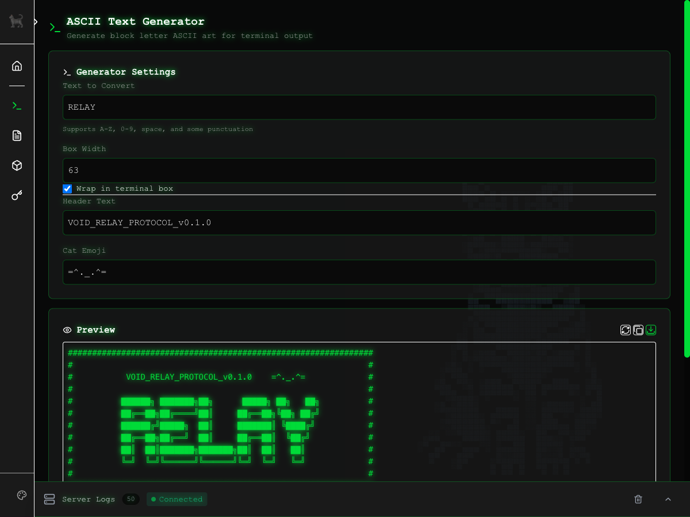

# void-plugin-ascii

ASCII text generator plugin for void-server. Generates block letter ASCII art with optional terminal-style box framing.



## Features

- **Block Letter Generation**: Convert text to ANSI Shadow style ASCII art
- **Terminal Box Framing**: Optional decorative box with customizable width
- **Header Customization**: Add protocol headers and cat emojis
- **Copy & Download**: One-click copy to clipboard or download as .txt file
- **Character Reference**: Quick-click character buttons

## Supported Characters

- Letters: A-Z (case insensitive)
- Numbers: 0-9
- Punctuation: `_`, `-`, `.`, `:`, `/`, `!`, `?`, space

## Installation

### From the Plugin Manager UI

1. Navigate to the **Plugins** page in void-server
2. Find "void-plugin-ascii" in the available plugins list
3. Click **Install**
4. Restart the server when prompted

### Via Command Line

```bash
cd void-server
git submodule add https://github.com/anthropics/void-plugin-ascii.git plugins/void-plugin-ascii
git submodule update --init --recursive
```

## Configuration

Default mount path: `/ascii`

Navigation appears as a standalone item (no section grouping).

## Usage

1. Enter text in the input field
2. Optionally enable terminal box framing
3. Customize header text and cat emoji
4. Adjust box width as needed
5. Copy output or download as text file

## License

MIT
