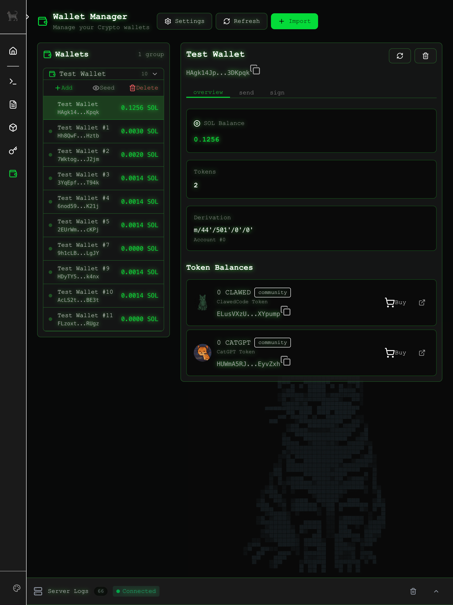
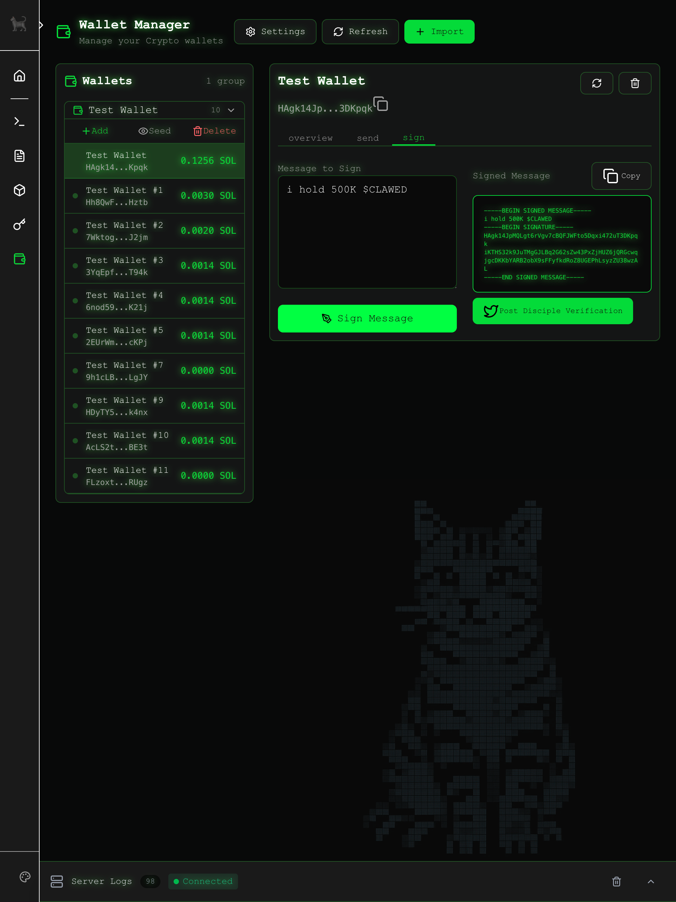

# void-plugin-wallet

Crypto wallet management plugin for void-server with send and sign capabilities.




*Sign a message to verify yourself as a disciple*

### Disciple Verification

To verify yourself as a disciple:

1. Hold the required tokens in your wallet:
   - **500,000 $CLAWED** and/or **5,000,000 $CATGPT**
2. Sign a message using the **Sign** tab
3. Post to X tagging **@ClawedCode** with **#ClawedDisciple** and your signed message
4. Include the wallet address that holds the tokens

Disciple status is checked periodically to verify token holdings.

## Features

- Import wallets from seed phrases (12/24 word mnemonics) or private keys
- BIP44-compliant address derivation (m/44'/501'/n'/0')
- AES-256-GCM encrypted seed storage
- Multi-address wallet groups
- Live SOL and token balance checking via Solana RPC
- Send SOL and SPL tokens
- Buy tokens with SOL via Jupiter aggregator
- Sign messages with Ed25519
- Known token tracking (CLAWED, CATGPT)
- Configurable RPC (Helius, custom, or public)

## Installation

### From the Plugin Manager UI

1. Navigate to the **Plugins** page in void-server
2. Find "void-plugin-wallet" in the available plugins list
3. Click **Install**
4. Restart the server when prompted

### Via Command Line

```bash
cd void-server
git submodule add https://github.com/ClawedCode/void-plugin-wallet.git plugins/void-plugin-wallet
git submodule update --init --recursive
cd plugins/void-plugin-wallet
npm install
cd ../..
npm run restart
```

### Development (Symlink)

```bash
cd void-server/plugins
ln -s ../../void-plugin-wallet void-plugin-wallet
cd void-plugin-wallet && npm install
cd ../.. && npm run restart
```

## Usage

### Import a Wallet

1. Click the **+** button in the Wallets sidebar
2. Enter a name for the wallet
3. Paste your seed phrase or private key
4. Click **Preview Addresses** to see derived addresses
5. Select which addresses to import
6. Click **Import**

### Send Tokens

1. Select a wallet from the sidebar
2. Go to the **Send** tab
3. Select SOL or a known token
4. Enter the recipient address and amount
5. Toggle **Test Mode** off for real transactions
6. Click **Send**

### Sign Messages

1. Select a wallet from the sidebar
2. Go to the **Sign** tab
3. Enter your message
4. Click **Sign Message**
5. Copy the signed message block

## Security

- **Encryption key**: Auto-generated on first use, stored in `data/.secret-key` (gitignored)
- **Seed phrases**: Encrypted with AES-256-GCM before storage
- **Private keys**: Never stored, derived on-demand from encrypted seed
- **Test mode**: Enabled by default for transactions

## Configuration

Default mount path: `/wallet`

Navigation appears as a standalone item with the wallet icon.

### RPC Configuration

Configure the Solana RPC endpoint in the plugin settings:

| Setting | Description |
|---------|-------------|
| `heliusApiKey` | Helius API key for reliable RPC access (recommended) |
| `rpcUrl` | Custom RPC URL (overrides Helius if both set) |
| `jupiterApiKey` | Jupiter API key for token swaps (required for buy feature) |

**RPC Priority order:**
1. `heliusApiKey` → `https://mainnet.helius-rpc.com/?api-key=YOUR_KEY`
2. `rpcUrl` → Custom endpoint
3. `SOLANA_RPC_URL` env variable
4. `https://api.mainnet-beta.solana.com` (public, rate-limited)

**Recommended:** Get a free Helius API key at [helius.dev](https://helius.dev) for production use.

### Jupiter API Configuration

Token buying requires a Jupiter API key. Get one at [portal.jup.ag](https://portal.jup.ag/).

Configure via:
- Plugin setting: `jupiterApiKey`
- Environment variable: `JUPITER_API_KEY`

Without a Jupiter API key, the buy token feature will be disabled.

## External APIs

This plugin uses the following external services:

| Service | Purpose | Authentication |
|---------|---------|----------------|
| **Solana RPC** | Balance queries, transaction submission | Optional (Helius key recommended) |
| **Jupiter API** | Token swap quotes and execution | **Required** (API key) |
| **Solscan** | Explorer links (client-side only) | None |

### Solana RPC (`configurable`)
- **Default:** `https://api.mainnet-beta.solana.com`
- **Used for:** Balance checks, token account queries, transaction submission
- **Note:** Public endpoint is rate-limited. Use Helius or custom RPC for production.

### Jupiter Aggregator (`https://api.jup.ag/swap/v1/`)
- **Endpoints:** `/quote`, `/swap`
- **Used for:** Token buy feature (SOL → token swaps)
- **Authentication:** API key required (get at [portal.jup.ag](https://portal.jup.ag/))
- **Docs:** [dev.jup.ag](https://dev.jup.ag/docs/swap-api)

### Solscan (`https://solscan.io/`)
- **Used for:** Explorer links (tokens, transactions)
- **Client-side only:** No API calls, just link generation

## Data Files

| File | Purpose | Git Status |
|------|---------|------------|
| `data/.secret-key` | Encryption key | Ignored |
| `data/wallets.json` | Encrypted wallet data | Ignored |
| `data/known-tokens.json` | CLAWED/CATGPT token info | Tracked |

## API Endpoints

| Method | Endpoint | Purpose |
|--------|----------|---------|
| GET | `/api/wallet/groups` | List wallet groups |
| GET | `/api/wallet/:id` | Get wallet details + balances |
| POST | `/api/wallet/create` | Import wallet from seed |
| DELETE | `/api/wallet/:id` | Delete wallet/address |
| PATCH | `/api/wallet/:id/label` | Update address label |
| POST | `/api/wallet/derive` | Preview addresses from seed |
| POST | `/api/wallet/:id/derive-more` | Derive additional addresses |
| POST | `/api/wallet/:id/send` | Send SOL or tokens |
| POST | `/api/wallet/:id/buy` | Buy token with SOL (Jupiter swap) |
| POST | `/api/wallet/sign` | Sign message |
| GET | `/api/wallet/known-tokens` | Get token info |

## License

MIT
